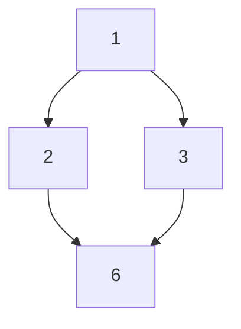

# Extremal Elements in Partially Ordered Sets

This repo contains examples of **extremal elements**:
1. Maximal  
2. Minimal  
3. Greatest  
4. Least  
5. Upper Bound  
6. Lower Bound  
+ their relationships (combos)

---
## Example 1: Divisibility on {1,2,3,6}

- **Maximal**: {2, 3, 6}  
- **Minimal**: {1, 2, 3}  
- **Greatest**: 6  
- **Least**: 1  
- **Upper bound of {2,3}**: 6  
- **Lower bound of {2,3}**: 1  

### Hasse Diagram


---

## Example 2: Subset Inclusion on { {1}, {2}, {1,2} }

- **Maximal**: {1,2}  
- **Minimal**: {1}, {2}  
- **Greatest**: {1,2}  
- **Least**: None  

### Hasse Diagram

```mermaid
graph TB
  A["{1}"]
  B["{2}"]
  C["{1,2}"]

  A --> C
  B --> C
'''

---


## Example 3: Natural Numbers (ℕ, ≤)

- **Maximal**: None  
- **Minimal**: 0  
- **Greatest**: None  
- **Least**: 0  
- **Upper bound of {2,5}**: any n ≥ 5  
- **Lower bound of {2,5}**: any n ≤ 2  

### ASCII Diagram
```
0 < 1 < 2 < 3 < 4 < 5 < ...
```

---

## Combos (Relationships)

- If **greatest element** exists → it is **maximal**.  
- If **least element** exists → it is **minimal**.  
- A poset can have **many maximal/minimal**, but **at most one greatest/least**.  
- Every **greatest = upper bound**, every **least = lower bound**.  
- **Supremum (LUB)** = least among upper bounds.  
- **Infimum (GLB)** = greatest among lower bounds.  
